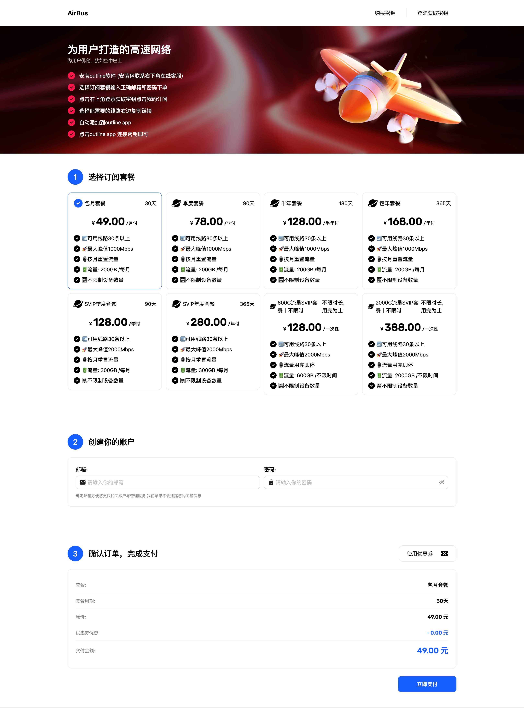
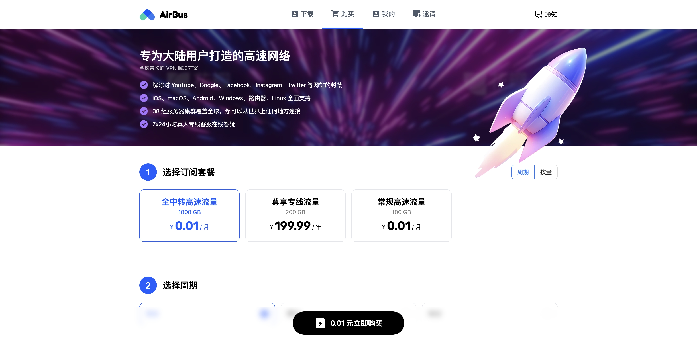
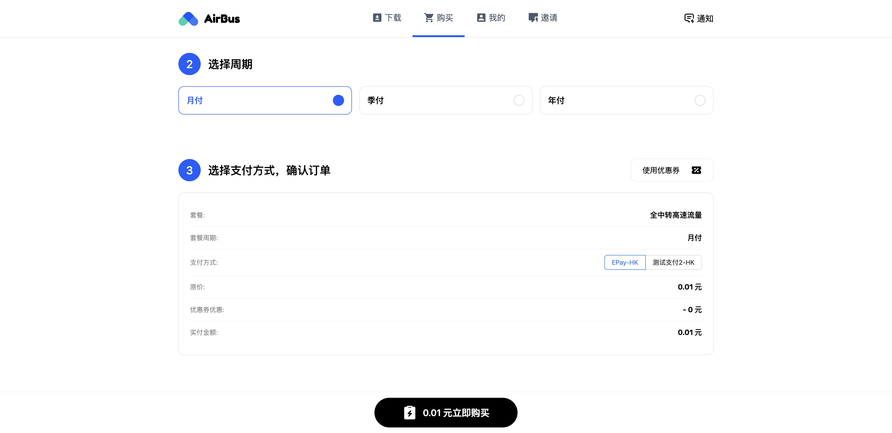
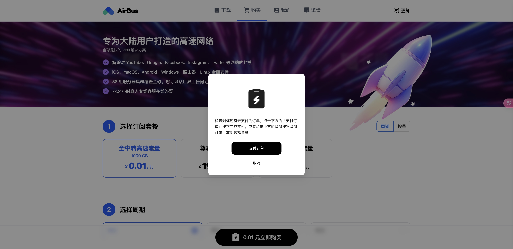
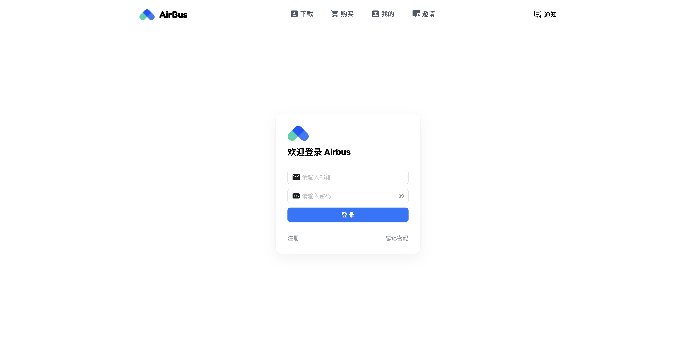
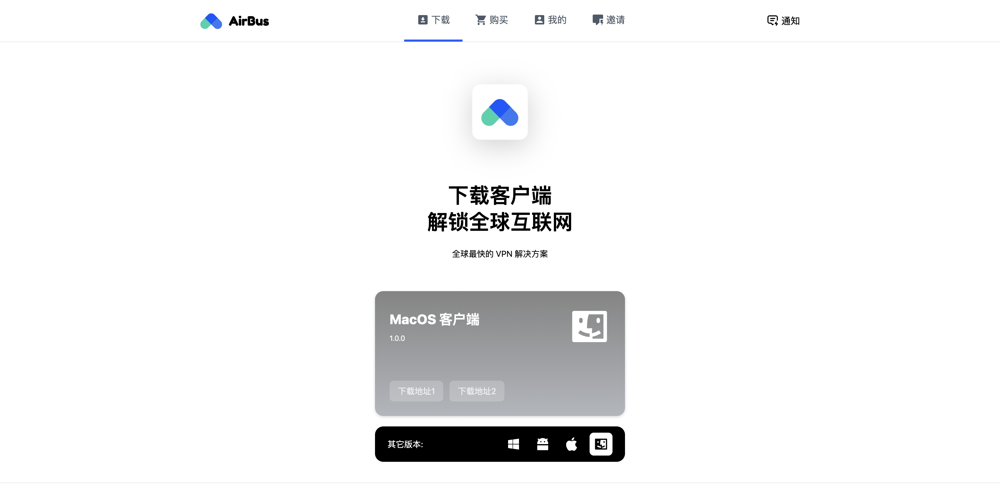
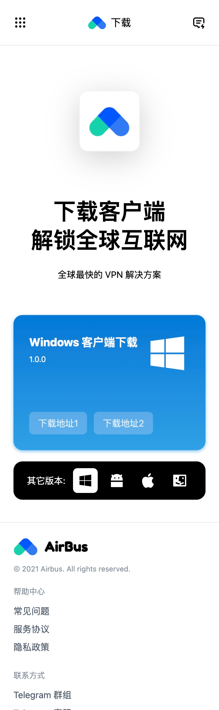
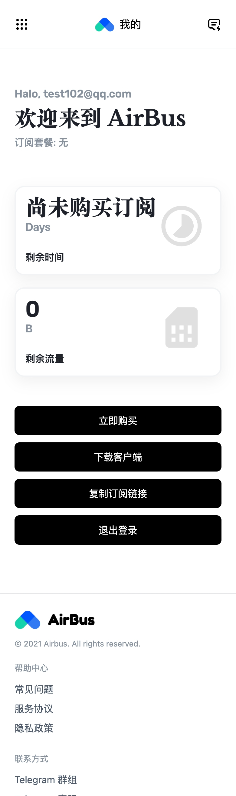
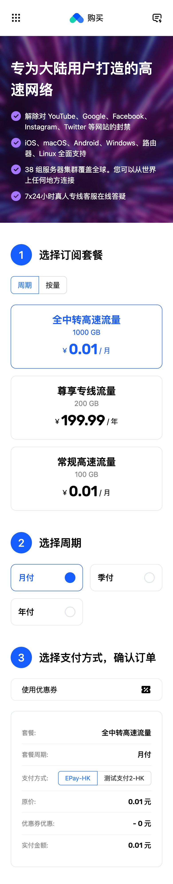

<p align="center"></p>
<p align="center"></p>
<p align="center"><b>前后端分离、防墙去特征、开源免费的 v2board/xboard 主题</b></p>


------------------------------

## 主题信息

*   主题名称 ：**AirBuddy Bus**
*   主题版本 ：**1.3.2**
*   更新日期 : 2024/06/21
*   环境兼容 : [**v2board**](https://github.com/wyx2685/v2board) / [**xboard**](https://github.com/cedar2025/Xboard)
*   主题特性 : 前后端分离、加载速度快、体积小、防墙、去特征
*   主题价格 : **永久开源免费**
*   在线预览 : [**buddy.appie.top**](https://buddy.appie.top/)
*   预览账号 : demo@gmail.com / 12345678
*   交流群组 : [**https://t.me/themebuddy**](https://t.me/themebuddy)

## 常见问题

#### 1.前端主题如何部署？

可参考 Youtube 视频教程: [**https://youtu.be/aWl9YJMTFsM?si=gRY5R5STxK9k5PhD**](https://youtu.be/aWl9YJMTFsM?si=gRY5R5STxK9k5PhD)

#### 2.支付完成后不能正确跳转的请修改 epay.php
```
 'return_url' => $order['return_url'], 
```
修改为：
```
'return_url' => config('v2board.app_url') . '/#/dashboard/checkout/' . $order['trade_no'], 
```

#### 3.知识库教程文档如何编写？

我们内置了一系列样式规则，包括色块、按钮、复制订阅等能力，您只需按照规则编写即可，具体规则请参考 [**教程样式规则**](教程样式规则.md)


------------------------------

## 主题定制

我们具备出色的用户体验设计能力、以及搞定一切的全栈开发能力，如果您有定制需求，请加 telegram 群组联系我们
telegram 群组 : [**https://t.me/themebuddy**](https://t.me/themebuddy)，我们提供的不仅仅是主题代码，而是为你量身订做的最优解决方案，我们的目标是帮助您解决业务问题，而不是卖代码

## 定制案例

### 1.购买注册一体化

微改造 v2board/xboard 后端，无需用户先注册再购买，用户选择套餐，输入邮箱密码，直接购买成功，自动注册账号，减少用户注册成本，提高用户转化率



### 2.兑换码发卡系统

结合 v2board/xboard 后端，实现兑换码发卡系统，后台可以批量生成指定订阅的兑换码，下发给代理商，代理商销售给用户，用户通过兑换码激活订阅，实现自动化发卡，无需进入支付页面，减少用户转化路径成本.


### 3.自定义布局、自定义主题风格

根据用户需求，自定义为上下布局布局、自定义主题风格，实现个性化定制，提高用户体验








移动端预览：

| 下载页 | 个人页 | 购买页 |
|--------------------------|--------------------------|----------------------------|
|  |  |  |

```
重要提醒: 
定制案例不进行二次销售，谢绝上门就要求过往案例源码的客户
如需定制，只需向我们阐述您的核心诉求，我们将为你提供最优的解决方案，包含设计和技术方案
我们提供的不仅仅是主题代码，更是一整套解决方案，我们的目标是帮助您解决问题，而不是卖代码
```
